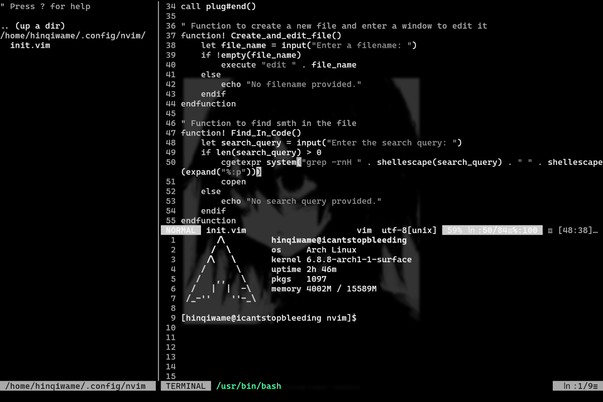

# nvim-on-meth
my neovim config
 
>theme used: `nord` with [pywal](https://github.com/dylanaraps/pywal)

# why
- highly customizable
- code completion
- file explorer
- terminal emulator built-in
- full theme set (it's so good with pywal)
- all the necessary functions binded (at least for me but new bindings can be added easily)

# plugins used
- [coc.nvim](https://github.com/neoclide/coc.nvim) - autocmpletion
- [nerdtree](https://github.com/preservim/nerdtree) - file explorer
- [vim-airline](https://github.com/vim-airline/vim-airline) - airline
- [vim-airline-themes](https://github.com/vim-airline/vim-airline-themes) - themes for airlines
- [awesome-vim-colorschemes](https://github.com/rafi/awesome-vim-colorschemes) - themes pack
- [vim-transparent](https://github.com/tribela/vim-transparent) - make the coloscheme transparent

# keybinds
- `Ctrl + F` - open/close file explorer
- `Ctrl + Z` - undo last edit
- `Ctrl + W` - save/write the file
- `Ctrl + Q` - exit
- `Ctrl + N` - create and edit a new file
- `Ctrl + T` - open up a terminal emulator
- `Ctrl + S` - find smth in the code
